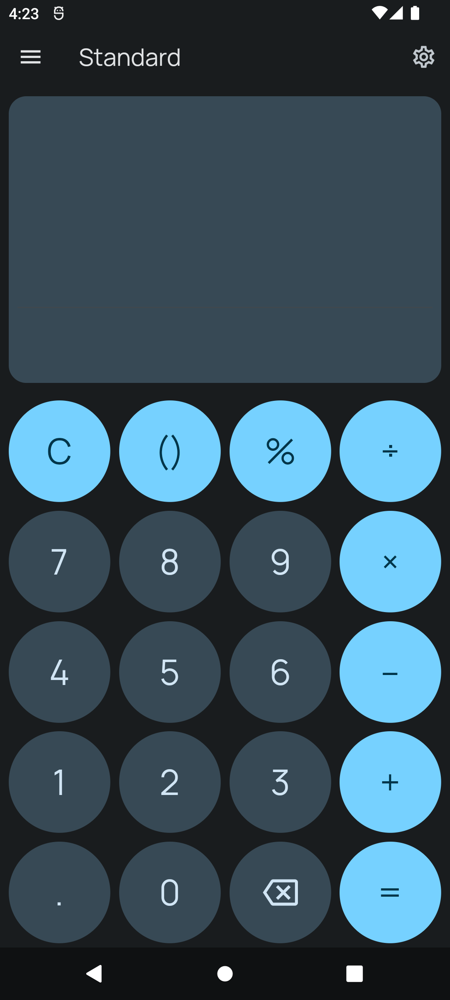
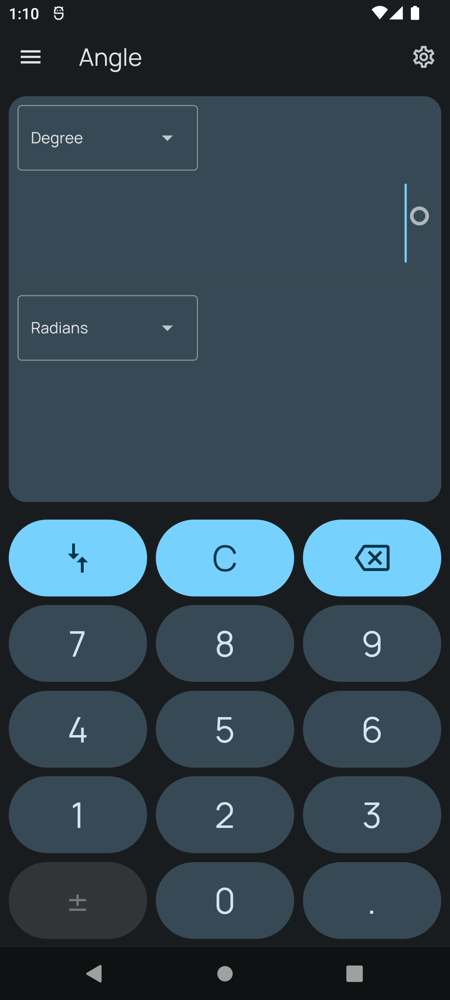

# Mint Calculator

### **!! Notice: After v1.1.0 I'll be in hiatus for sometime writing this calculator from scratch and also bring scientific calculator. Meanwhile please report any bugs if you find and feature request are appreciated!**

A simple calculator and unit converter app with Material Design 3 inspired by Windows Calculator

## Features

 - Standard Calculator 
 - Date Calculator 
 - Simple unit converter (Angle, Time, Data, Length, Area, Volume, etc...)

## Screenshots

| Calculator  | Converter   |
| ------------ | ------------ |
|   |   |

## Planned updates

 - Scientific calculator