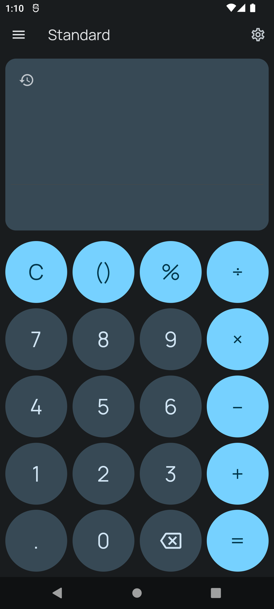

# Mint Calculator
A simple calculator and unit converter app with Material Design 3 inspired by Windows Calculator

## Features

 - Standard Calculator 
 - Date Calculator 
 - Simple unit converter (Angle, Time, Data, Length, Area, Volume, etc...)

## Screenshots

| Calculator  | Converter   |
| ------------ | ------------ |
|   |   |

## Planned updates

 - Scientific calculator
 - Calculator history
 - Optimization for larger screen